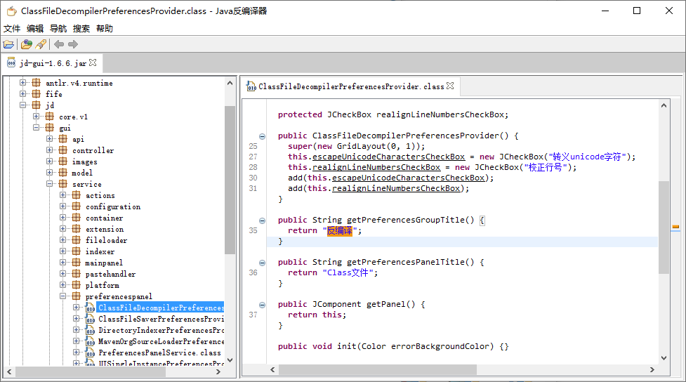

# JD-GUI 中文

JD-GUI, 一个独立的可视化程序，显示Class文件中的Java源代码.



- Java Decompiler工程主页: [http://java-decompiler.github.io](http://java-decompiler.github.io)
- JD-GUI源代码: [https://github.com/java-decompiler/jd-gui](https://github.com/java-decompiler/jd-gui)

## 概要
JD-GUI是一个独立的可视化的实用程序，它能显示
".class"文件.您可以使用其来浏览重构的源代码
用于即时访问方法和字段.

## 如何搭建 JD-GUI ?
使用git命令
```
> git clone https://github.com/java-decompiler/jd-gui.git
> cd jd-gui
> ./gradlew build 
```
生成程序 :**x.y.z**为当前文件版本号
- _"build/libs/jd-gui-x.y.z.jar"_
- _"build/libs/jd-gui-x.y.z-min.jar"_
- _"build/distributions/jd-gui-windows-x.y.z.zip"_
- _"build/distributions/jd-gui-osx-x.y.z.tar"_
- _"build/distributions/jd-gui-x.y.z.deb"_
- _"build/distributions/jd-gui-x.y.z.rpm"_

## 如何启动 JD-GUI ?
- 双击 _"jd-gui-x.y.z.jar"_
- 在Windows双击 _"jd-gui.exe"_ 程序
- 在Mac OSX 双击 _"JD-GUI"_ 程序
- 在终端执行 `java -jar jd-gui-x.y.z.jar` 或 `java -classpath jd-gui-x.y.z.jar org.jd.gui.App` 命令

## 如何使用 JD-GUI ?
- 使用菜单打开文件 "文件 > 打开文件..."
- 在菜单中选择最近使用 "文件 > 最近使用"
- 从你的文件管理器中拖拽文件到程序窗口

## 如何扩展 JD-GUI ?
```
> ./gradlew idea 
```
生成Idea Intellij项目
```
> ./gradlew eclipse
```
生成Eclipse项目
```
> java -classpath jd-gui-x.y.z.jar;myextension1.jar;myextension2.jar org.jd.gui.App
```
使用扩展启动JD-GUI

## 如何卸载 JD-GUI ?
- Java: 直接删除"jd-gui-x.y.z.jar" 和 "jd-gui.cfg".
- Mac OSX: 拖拽 "JD-GUI" 程序文件到系统回收站.
- Windows: 删除"jd-gui.exe" 和 "jd-gui.cfg".

## License
遵循[GNU GPL v3](LICENSE)下发布.

## 捐赠
JD-GUI 是否帮助您解决了燃眉之急? 你是否经常使用JD-Eclipse? 要不要来点捐赠?

[](https://www.paypal.com/cgi-bin/webscr?cmd=_s-xclick&hosted_button_id=C88ZMVZ78RF22) [](https://www.paypal.com/cgi-bin/webscr?cmd=_s-xclick&hosted_button_id=CRMXT4Y4QLQGU)
